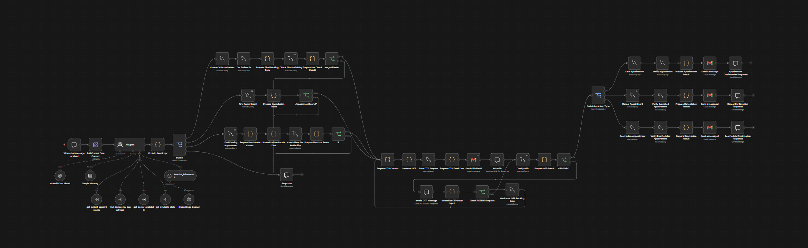
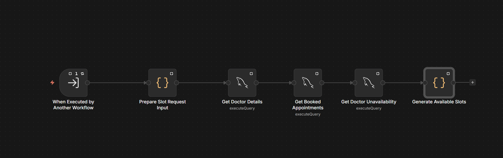
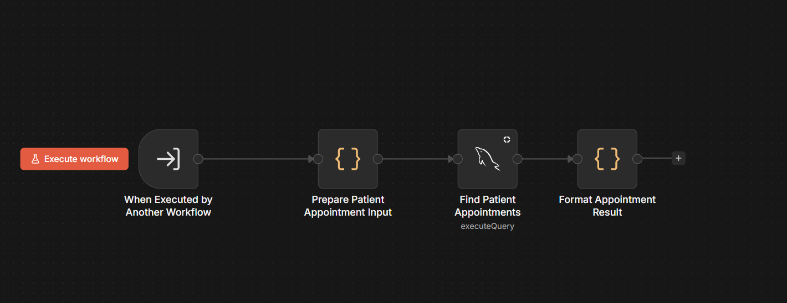
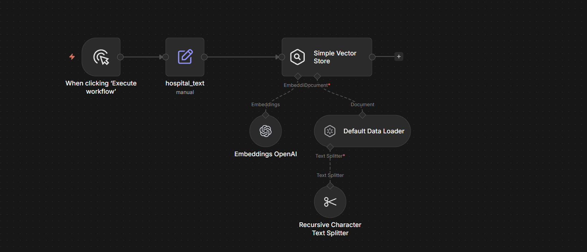
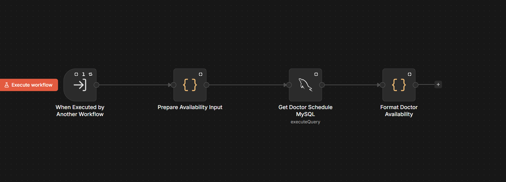
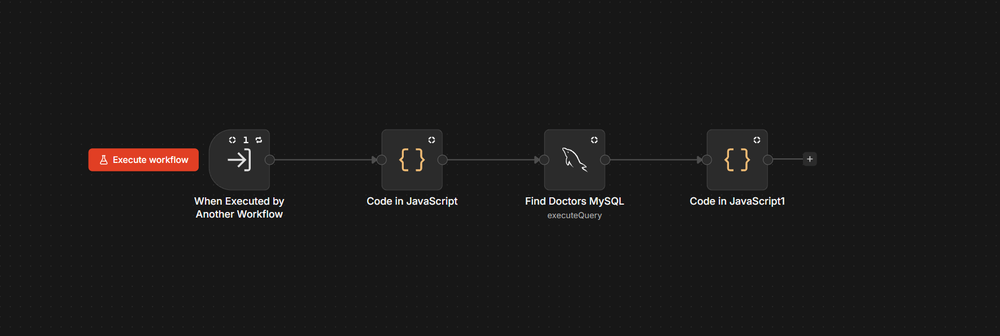
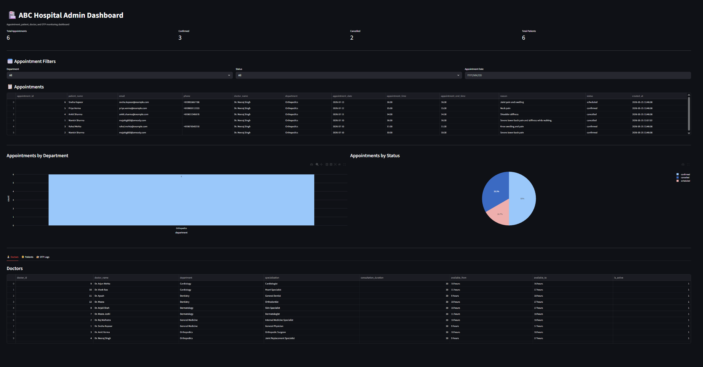

# AI Clinic Appointment Management System

An AI-powered clinic automation platform built using **n8n**, **OpenAI**, **MySQL**, **Gmail**, and a custom SQL-based appointment engine.

This system acts as a virtual AI receptionist capable of handling appointment booking, cancellation, rescheduling, doctor availability checks, OTP verification, and admin dashboard management through conversational AI workflows.

---

## 🚀 Features

### 🤖 AI Conversational Receptionist
- Natural language patient interaction
- AI-powered intent detection
- Human-like conversation flow
- Smart patient information extraction

### 📅 Appointment Management
- Book appointments
- Cancel appointments
- Reschedule appointments
- Appointment verification flow
- Appointment conflict prevention

### 👨‍⚕️ Doctor Availability Engine
- SQL-based slot generation engine
- Real-time doctor availability checking
- Doctor unavailability management
- Dynamic available slot generation
- Department-wise doctor lookup

### 🔐 OTP Verification System
- OTP generation
- Email OTP delivery
- OTP validation workflow
- Retry handling logic
- Secure appointment confirmation

### 🗄️ SQL Appointment Engine
- Fully custom scheduling engine
- MySQL appointment management
- Patient records storage
- Doctor scheduling management
- Appointment status tracking

### 📊 Admin Dashboard
- Total appointments analytics
- Confirmed & cancelled appointment metrics
- Patient records management
- Department analytics
- Appointment filtering
- Doctor management dashboard

---

## 🏗️ Workflow Architecture

```
Patient Chat
     ↓
AI Agent (OpenAI)
     ↓
Intent Detection
     ↓
Booking / Cancel / Reschedule Flow
     ↓
Doctor Availability Engine
     ↓
OTP Verification
     ↓
MySQL Database
     ↓
Admin Dashboard Update
     ↓
Email Confirmation
```

---

## 🧠 Main Workflow

This is the primary orchestration workflow handling:
- AI conversation
- Appointment logic
- OTP flow
- Booking management
- Cancellation handling
- Rescheduling logic

**Workflow Screenshot**


---

## 📌 Included Workflows

### 1️⃣ Doctor Slot Generation Engine

Handles:
- Doctor lookup
- Booked slot detection
- Unavailable slot handling
- Dynamic available slot generation



---

### 2️⃣ Patient Appointment Finder

Handles:
- Patient appointment lookup
- Appointment formatting
- Existing booking retrieval



---

### 3️⃣ Hospital Knowledge Base (RAG)

Handles:
- Hospital information embeddings
- Vector storage
- Semantic retrieval
- FAQ knowledge support



---

### 4️⃣ Doctor Availability Workflow

Handles:
- Doctor schedule retrieval
- Availability formatting
- Department-based availability checks



---

### 5️⃣ Doctor Search Workflow

Handles:
- Department-based doctor search
- Doctor information formatting
- Doctor recommendation logic



---

### 6️⃣ Admin Dashboard

Features:
- Appointment analytics
- Patient records
- Doctor management
- Appointment filtering
- Status monitoring



---

## 🛠️ Tech Stack

| Technology | Purpose |
|---|---|
| n8n | Workflow Automation |
| OpenAI | AI Conversational Logic |
| MySQL | Appointment Engine & Database |
| Gmail API | OTP & Email Notifications |
| Python | Backend Dashboard |
| Streamlit | Admin Dashboard UI |
| Vector Store | RAG Knowledge Base |

---

## 📂 Project Structure

```
AI-Clinic-Appointment-Management-System/
│
├── workflows/
│   ├── main_workflow.json
│   ├── slot_generation_engine.json
│   ├── patient_appointment_lookup.json
│   ├── doctor_availability.json
│   ├── doctor_search.json
│   └── hospital_rag.json
│
├── dashboard/
│
├── sql/
│   ├── schema.sql
│   └── sample_data.sql
│
├── images/
│   ├── main_workflow.png
│   ├── slot_generation_engine.png
│   ├── patient_appointment_lookup.png
│   ├── hospital_rag.png
│   ├── doctor_availability.png
│   ├── doctor_search.png
│   └── admin_dashboard.png
│
├── prompts/
│
├── .env.example
│
└── README.md
```

---

## ⚙️ Installation Guide

### 1. Clone Repository

```bash
git clone https://github.com/yourusername/AI-Clinic-Appointment-Management-System.git
```

### 2. Setup n8n

Run n8n using Docker:

```bash
docker run -it --rm \
  -p 5678:5678 \
  -v ~/.n8n:/home/node/.n8n \
  n8nio/n8n
```

### 3. Import Workflows

1. Open n8n
2. Import all workflow JSON files
3. Configure all credentials

### 4. Configure Credentials

Required integrations:
- OpenAI API
- Gmail OAuth/API
- MySQL Database

### 5. Setup Environment Variables

Create `.env`:

```env
OPENAI_API_KEY=your_openai_api_key

MYSQL_HOST=localhost
MYSQL_PORT=3306
MYSQL_USER=root
MYSQL_PASSWORD=your_password
MYSQL_DATABASE=clinic_db

GMAIL_USER=your_email@gmail.com
```

### 6. Setup Database

Create database:

```sql
CREATE DATABASE clinic_db;
```

Import schema files from:

```
/sql/schema.sql
```

---

## 📈 Business Impact

### Clinics Can:
- Automate receptionist operations
- Reduce manual scheduling work
- Improve patient response time
- Prevent appointment conflicts
- Enable 24/7 appointment booking
- Reduce operational overhead
- Improve scheduling accuracy

---

## 💡 Key Automation Benefits

- Faster appointment handling
- Reduced human error
- Better doctor schedule management
- Improved clinic productivity
- AI-powered patient interaction
- Scalable workflow automation

---

## 🔮 Future Improvements

### Planned Features
- WhatsApp integration
- Voice AI receptionist
- SMS reminders
- Multi-clinic support
- Billing & payment integration
- Patient history AI assistant
- Role-based authentication
- Mobile application
- AI-powered no-show prediction
- Multi-language support

---

## 🔐 Security Notes

- API keys are **NOT** included
- Configure your own credentials
- Use `.env` for secrets
- **Never** upload credentials to GitHub

---

## 📷 Screenshots

Place all screenshots inside `/images/`

Recommended filenames:
- `main_workflow.png`
- `slot_generation_engine.png`
- `patient_appointment_lookup.png`
- `hospital_rag.png`
- `doctor_availability.png`
- `doctor_search.png`
- `admin_dashboard.png`

---

## 👨‍💻 Author

**Ayush**  
AI Automation & GenAI Developer

---

## 📜 License

This project is licensed under the [MIT License](LICENSE).
